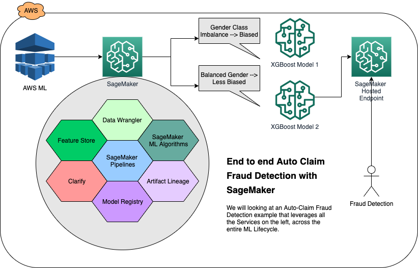
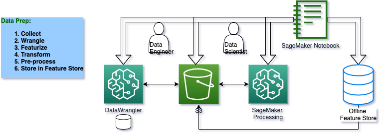
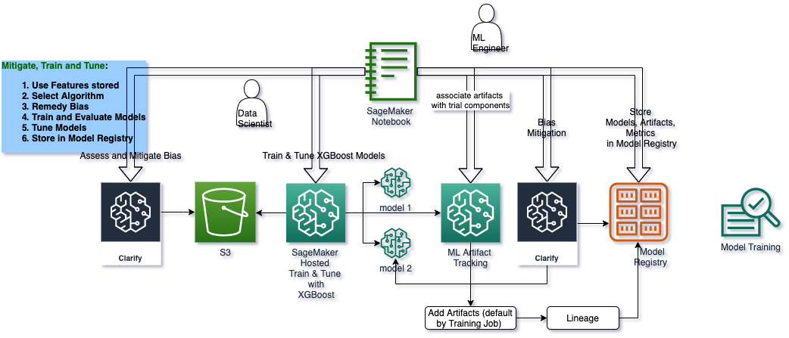
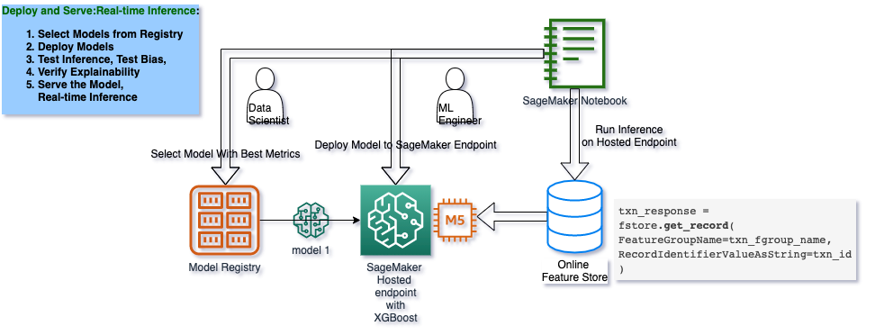
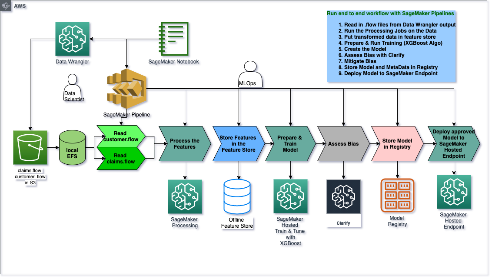

# Architect and Build an End-to-End Workflow for Auto Claim Fraud Detection with SageMaker Services

The purpose of this end-to-end example is to demonstrate how to prepare, train, and deploy a model that detects auto insurance claims.

## Contents
1. [Business Problem](#business-problem)
2. [Technical Solution](#nb0-solution)
3. [Solution Components](#nb0-components)
4. [Solution Architecture](#nb0-architecture)
5. [Code Resources](#nb0-code)

## Business Problem

<i> "Auto insurance fraud ranges from misrepresenting facts on insurance applications and inflating insurance claims to staging accidents and submitting claim forms for injuries or damage that never occurred, to false reports of stolen vehicles.
Fraud accounted for between 15 percent and 17 percent of total claims payments for auto insurance bodily injury in 2012, according to an Insurance Research Council (IRC) study. The study estimated that between \$5.6 billion and \$7.7 billion was fraudulently added to paid claims for auto insurance bodily injury payments in 2012, compared with a range of \$4.3 billion to \$5.8 billion in 2002. </i>" [source: Insurance Information Institute](https://www.iii.org/article/background-on-insurance-fraud)

In this example, we will use an *auto insurance domain* to detect claims that are possibly fraudulent.  
more precisely we address the use-case: <i> "what is the likelihood that a given auto claim is fraudulent?" </i>, and explore the technical solution.  

As you review the notebooks and the [architectures](#nb0-architecture) presented at each stage of the ML life cycle, you will see how you can leverage SageMaker services and features to enhance your effectiveness as a data scientist, as a machine learning engineer, and as an ML Ops Engineer.

We then perform data exploration on the synthetically generated datasets for Customers and Claims.

### Car Insurance Claims: Data Sets and Problem Domain

The inputs for building our model and workflow are two tables of insurance data: a claims table and a customers table. This data was synthetically generated is provided to you in its raw state for pre-processing with SageMaker Data Wrangler. However, completing the SageMaker Data Wrangler step is not required to continue with the rest of this notebook. If you wish, you may use the `claims_preprocessed.csv` and `customers_preprocessed.csv` in the `data` directory as they are exact copies of what SageMaker Data Wrangler would output.

## Technical Solution

In this introduction, you will look at the technical architecture and solution components to build a solution for predicting fraudulent insurance claims and deploy it using SageMaker for real-time predictions. While a deployed model is the end-product of this notebook series, the purpose of this guide is to walk you through all the detailed stages of the [machine learning (ML) lifecycle](#ml-lifecycle) and show you what SageMaker services and features are there to support your activities in each stage.

## Solution Components
    
The following [SageMaker](https://sagemaker.readthedocs.io/en/stable/v2.html) Services are used in this solution:

 1. [SageMaker DataWrangler](https://aws.amazon.com/sagemaker/data-wrangler/) - [docs](https://docs.aws.amazon.com/sagemaker/latest/dg/data-wrangler.html)
 1. [SageMaker Processing](https://aws.amazon.com/blogs/aws/amazon-sagemaker-processing-fully-managed-data-processing-and-model-evaluation/) - [docs](https://sagemaker.readthedocs.io/en/stable/amazon_sagemaker_processing.html)
 1. [SageMaker Feature Store](https://aws.amazon.com/sagemaker/feature-store/)- [docs](https://sagemaker.readthedocs.io/en/stable/amazon_sagemaker_featurestore.html)
 1. [SageMaker Clarify](https://aws.amazon.com/sagemaker/clarify/)- [docs](https://docs.aws.amazon.com/sagemaker/latest/dg/clarify-processing-job-run.html)
 1. [SageMaker Training with XGBoost Algorithm and Hyperparameter Optimization](https://sagemaker.readthedocs.io/en/stable/frameworks/xgboost/using_xgboost.html)- [docs](https://sagemaker.readthedocs.io/en/stable/frameworks/xgboost/index.html)
 1. [SageMaker Model Registry](https://docs.aws.amazon.com/sagemaker/latest/dg/model-registry.html)- [docs](https://docs.aws.amazon.com/sagemaker/latest/dg/model-registry-deploy.html#model-registry-deploy-api)
 1. [SageMaker Hosted Endpoints]()- [predictors - docs](https://sagemaker.readthedocs.io/en/stable/api/inference/predictors.html)
 1. [SageMaker Pipelines]()- [docs](https://sagemaker.readthedocs.io/en/stable/workflows/pipelines/index.html)
 

## Solution Architecture

We will go through 5 stages of ML and explore the solution architecture of SageMaker. Each of the sequancial notebooks will dive deep into corresponding ML stage.

### [Notebook 1](./0-AutoClaimFraudDetection.ipynb): Data Exploration

### [Notebook 2](./1-data-prep-e2e.ipynb): Data Preparation, Ingest, Transform, Preprocess, and Store in SageMaker Feature Store

### [Notebook 3](./2-lineage-train-assess-bias-tune-registry-e2e.ipynb) and [Notebook 4](./3-mitigate-bias-train-model2-registry-e2e.ipynb) : Train, Tune, Check Pre- and Post-Training Bias, Mitigate Bias, Re-train, Deposit, and Deploy the Best Model to SageMaker Model Registry

This is the architecture for model deployment.

### [Pipeline Notebook](./pipeline-e2e.ipynb): End-to-End Pipeline - MLOps Pipeline to run an end-to-end automated workflow with all the design decisions made during manual/exploratory steps in previous notebooks.

## Code Resources

### Stages

Our solution is split into the following stages of the [ML Lifecycle](#nb0-ml-lifecycle), and each stage has its own notebook:

* [Notebook 1: Data Exploration](./0-AutoClaimFraudDetection.ipynb): We first explore the data.
* [Notebook 2: Data Prep and Store](./1-data-prep-e2e.ipynb): We prepare a dataset for machine learning using SageMaker Data Wrangler, create and deposit the datasets in a SageMaker Feature Store.
* [Notebook 3: Train, Assess Bias, Establish Lineage, Register Model](./2-lineage-train-assess-bias-tune-registry-e2e.ipynb): We detect possible pre-training and post-training bias, train and tune a XGBoost model using Amazon SageMaker, record Lineage in the Model Registry so we can later deploy it. 
* [Notebook 4: Mitigate Bias, Re-train, Register, Deploy Unbiased Model](./3-mitigate-bias-train-model2-registry-e2e.ipynb): We mitigate bias, retrain a less biased model, store it in a Model Registry. We then deploy the model to a Amazon SageMaker Hosted Endpoint and run real-time inference via the SageMaker Online Feature Store.
* [Pipeline Notebook: Create and Run an MLOps Pipeline](./pipeline-e2e.ipynb): We then create a SageMaker Pipeline that ties together everything we have done so far, from outputs from Data Wrangler, Feature Store, Clarify, Model Registry and finally deployment to a SageMaker Hosted Endpoint.

